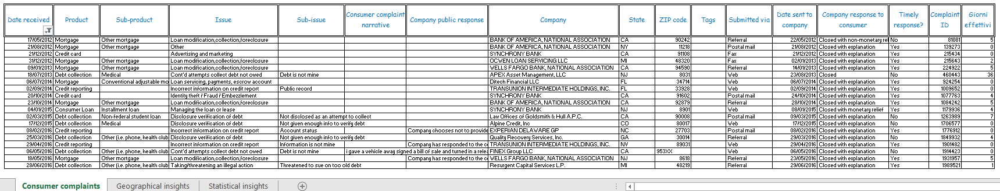
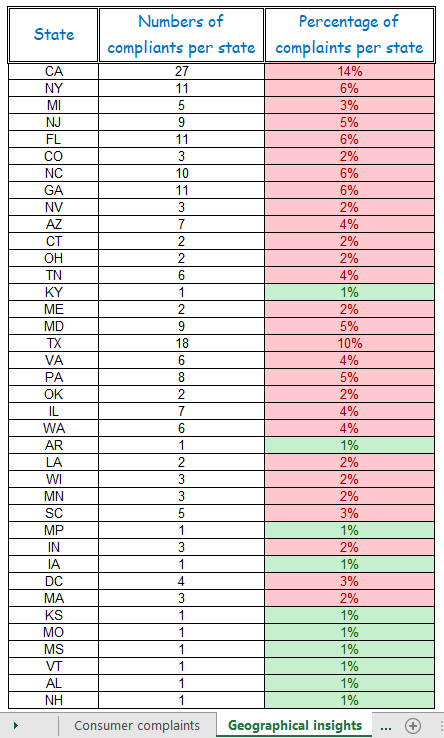
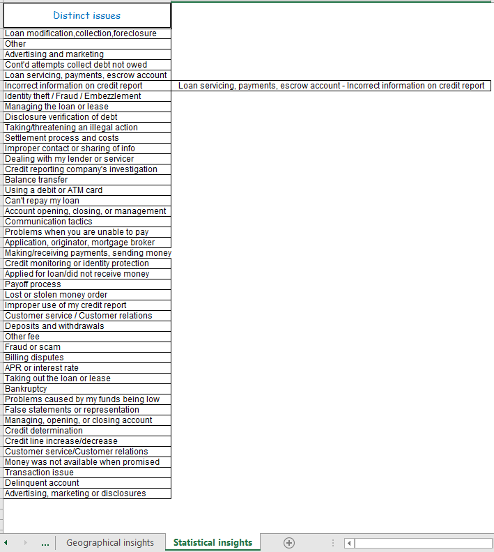

# Analisi dei reclami dei consumatori

Questo progetto rappresenta il caso studio finale per il modulo di **Fondamenti di analisi dati con Excel**, realizzato all'interno del mio percorso di **Master Professionale in Data Analytics certificato da ProfessionAI e Alteredu**.

## 🎯 Obiettivo del Progetto
Il progetto è stato commissionato da **FinServ Solutions**, azienda specializzata in software per il settore finanziario. L’obiettivo principale è stato la ristrutturazione integrale di un sistema di gestione reclami inefficiente, trasformandolo in uno strumento di Business Intelligence capace di ottimizzare l'accesso alle informazioni critiche e velocizzare il processo decisionale del team di Customer Service.

## 🛠️ Interventi Tecnici e Metodologia
Il lavoro è stato strutturato in tre moduli analitici (tab), ognuno progettato per rispondere a specifiche esigenze di business:

### 1. Consumer Complaints (Data Engineering & Cleaning)
*   **Normalizzazione dei dati:** Gestione formati data (dd/mm/yy) e pulizia dei record.
*   **Feature Engineering:** Implementazione di una metrica per il calcolo dei giorni effettivi intercorsi tra ricezione e invio della comunicazione per il monitoraggio dei tempi di risposta.
*   **Data Management:** Ordinamento crescente per Complaint ID e applicazione di filtri dinamici per analisi temporali specifiche.

### 2. Geographical Insights (Analisi Territoriale)
*   **Aggregazione Statistica:** Calcolo volumetrico dei reclami per ogni Stato tramite la funzione `CONTA.SE`.
*   **Analisi Percentuale:** Calcolo dell'incidenza relativa di ogni Stato sul totale dei reclami.
*   **KPI Monitoring:** Applicazione di formattazione condizionale per l'identificazione immediata delle aree critiche (alert visivo rosso per incidenza > 2%).

### 3. Statistical Insights (Analisi delle Issue)
*   **Data Structuring:** Estrazione dei valori distinti per identificare tutti i possibili motivi di reclamo.
*   **Analisi di Frequenza:** Calcolo del valore **Moda** per individuare la tipologia di problema più frequente, permettendo al management di stabilire le priorità d'intervento.

## 📊 Visualizzazione del Progetto

*Figura 1: Data Preparation e Feature Engineering. Visualizzazione del dataset principale dopo le operazioni di pulizia, normalizzazione delle date e calcolo degli SLA.*

*Figura 2: Analisi Geografica e Monitoraggio KPI. Dashboard territoriale con calcolo automatico delle incidenze percentuali e alert visivi per soglie critiche.*

*Figura 3: Analisi Statistica Descrittiva. Sintesi dei motivi di reclamo con individuazione della moda statistica per supportare il management nelle decisioni strategiche.*

## 📈 Impatto Business Atteso
*   **Efficienza decisionale:** Identificazione rapida delle problematiche ricorrenti e dei cluster geografici a rischio.
*   **Ottimizzazione dei tempi:** Monitoraggio costante del lead-time di risoluzione dei reclami.

---
**Formazione:** Progetto certificato da **ProfessionAI** e **Alteredu**.
**Autore:** [Massimiliano Izzo](www.linkedin.com/in/massimilianoizzo) – BI & Data Storytelling Specialist
